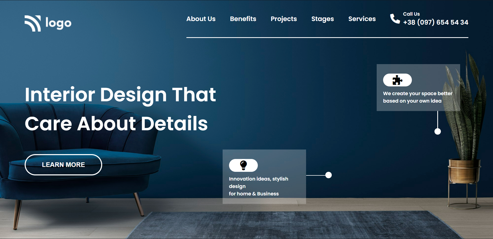

# Assignment 1

## Project 10 [Live Link](https://interior-design-og.netlify.app)

-   Skills Gained in this project
    -   Learned to structure the html file.
    -   Learned to styling the imported icons.

---

## Time taken to finish this project

-   Approximately 3-4 hour taken to complete this one.

#### Screenshot

